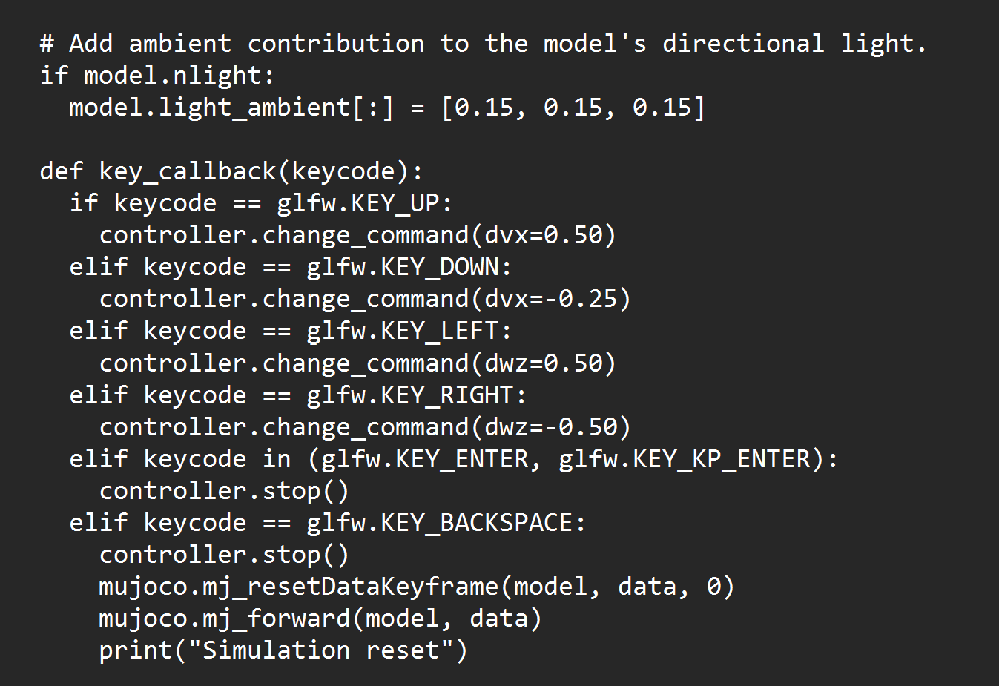

# Week 2 worksheet: Go1 controller behavior, control, and reinforcement learning

Name:  
Team: `team-alpha` / `team-bravo`  
Team branch: `team-alpha` / `team-bravo`

## 1. Baseline data table

Run the unchanged controller. Record the command after one input and the
observed motion. Press Enter before each trial so the command starts at zero.
Repeat each trial three times when possible.

| Trial | Input | vx forward | vy lateral | yaw rate | Observed motion |
|---:|---|---:|---:|---:|---|
| 1 | Up | 0.25| 0.00| 0.00| Robot moved forward|
| 2 | Up | 0.25| 0.00| 0.00| Robot moved forward|
| 3 | Up | 0.25| 0.00| 0.00| Robot moved forward|
| 1 | Left | 0.00 | 0.00| 0.50| Robot turned left|
| 2 | Left | 0.00| 0.00| 0.50| Robot turned left|
| 3 | Left | 0.00| 0.00| 0.50| Robot turned left|
| 1 | Down | -0.25 | 0.00| 0.00| Robot moved backward|
| 2 | Down | -0.25 | 0.00| 0.00| Robot moved backward|
| 3 | Down | -0.25 | 0.00| 0.00| Robot moved backward|
| 1 | Right | 0.00| 0.00| -0.50| Robot turned right|
| 2 | Right | 0.00| 0.00| -0.50| Robot turned right|
| 3 | Right | 0.00| 0.00| -0.50| Robot turned right|
| 1 | Enter | 0.00| 0.00| 0.00| Robot stopped|

## 2. Controller code map

Write one sentence for each function:

- `__init__`: Initializes the keyboard controller and sets up the starting command and controller state.
- `change_command`: Changes the requested forward, lateral, or turning velocity and keeps the command within its allowed range.
- `get_observation`: Takes the robot's current measurements and movement command and combines them into the information sent to the locomotion policy.
- `control`: Passes the observation through the ONNX locomotion policy and produces the joint actions used to move the robot.
- `key_callback`: Detects keyboard inputs and converts the arrow keys and Enter key into changes to the velocity command.

## 3. Control systems

In this Go1 setup:

- Reference command:The desired forward velocity, lateral velocity, and yaw rate. 
- Feedback/measurement: The measured state of the simulated Go1 robot.
- Controller: The pretrained locomotion policy.
- Plant: The Go1 robot simulated in MuJoCo.
- Actuator output: The 12 joint-action values produced by the policy.

Why is this a feedback-control system? 
This is a feedback-control system because the locomotion policy uses both the desired movement command and information about the robot's current state to continuously determine the joint actions needed to produce the requested motion. 

## 4. Reinforcement learning

Complete these statements:

- During policy training, the agent observes:information about the simulated robot's state along with the movement command it is supposed to follow. 
- The policy chooses: the joint actions used to control the robot's legs.
- A reward could encourage: the robot to remain stable, maintain balance, and accurately follow the requested forward, lateral, and turning velocities.
- The ONNX file used in the playground is: a pretrained locomotion policy that was trained before being used in this project.
- The policy returns 12 values because: Go1 has 12 actuated joints that must be controlled.

## 5. Required challenge: increase sensitivity

With instructor approval, change one command increment:

- Forward: `0.25` to `0.50`; or
- Turning: `0.50` to `1.00`.

Record the exact value you changed: I changed the dvx from 0.25 to 0.50

Before running again, check the code diff and make sure you changed only the
matching `dvx` or `dwz` value inside `key_callback`.

| Trial | Input | New vx | New vy | New yaw | Observed motion |
|---:|---|---:|---:|---:|---|
| 1 | Same input as baseline | 0.50| 0.00| 0.00| Robot moved forward with a larger command|
| 2 | Same input as baseline | 0.50| 0.00| 0.00| Robot moved forward with a larger command|
| 3 | Same input as baseline | 0.50| 0.00| 0.00| Robot moved forward with a larger command|

What changed compared with the baseline?  
The up arrow was doubled in value to increase the velocity by 0.50

Was the robot easier or harder to control? Why?
It was more difficult because it made it move at a more rapid pace  

What did you observe about the first command after pressing the key?
The robot immediately moved faster
Did the robot's visible motion change immediately, or after the command
accumulated over several key presses?
Immediately rather than multiple key presses as seen both in the simulation and command window.

Restore the baseline value after the experiment:  


## 7. Next-interface design

Choose: joystick

I would choose a joystick because it allows for more smooth control and easier command input.

[ input ] -> [ interpretation ] -> [ vx, vy, yaw ] -> [ safety check ] -> [ Go1 policy ]
```

What happens if the input stops updating? 

The control would account for the most recent input and after a programed time, set the movement command to 0 

One benefit:  

It would be smoother and more proportional

One risk or tradeoff:  
The timeout could be to short, potentially causing lost input

## Evidence

- Screenshot or recording: 
- Commit: 
e8ef356